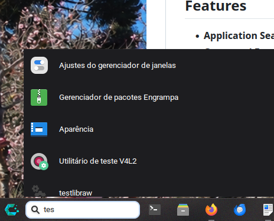

# XFCE4 Search Plugin

A lightweight search plugin for the XFCE4 panel that allows you to quickly search for and launch applications or execute shell commands directly from the panel.

## Features

- **Application Search**: Search for installed applications by name
- **Command Execution**: Run shell commands directly from the search box
- **Quick Access**: Integrated into the XFCE4 panel for easy access
- **Configurable**: Customizable settings for popup size, appearance, and behavior
- **Interactive Results**: Real-time search results displayed in a popup window

## Screenshot



## Requirements

### Build Dependencies

- **Meson** (>= 0.60.0) - Build system
- **C Compiler** (GCC or Clang)
- **pkg-config** - For dependency management

### Runtime Dependencies

- **GTK+ 3** (>= 3.22) - GUI toolkit
- **GLib** (>= 2.56) - Core library utilities
- **libxfce4panel** (>= 4.16) - XFCE panel interface library
- **libxfconf** - XFCE configuration system

## Installation

### On Debian/Ubuntu-based Systems

```bash
# Install build dependencies
sudo apt-get install build-essential meson pkg-config
sudo apt-get install libgtk-3-dev libglib2.0-dev
sudo apt-get install libxfce4panel-2.0-dev libxfconf-0-dev

# Clone and build
git clone <repository-url>
cd xfce4-search-plugin
meson setup builddir
cd builddir
meson compile
sudo meson install
```

### On Fedora/RHEL-based Systems

```bash
# Install build dependencies
sudo dnf install gcc meson pkg-config
sudo dnf install gtk3-devel glib2-devel
sudo dnf install xfce4-panel-devel libxfconf-devel

# Clone and build
git clone <repository-url>
cd xfce4-search-plugin
meson setup builddir
cd builddir
meson compile
sudo meson install
```

### On Arch Linux

```bash
# Install build dependencies
sudo pacman -S base-devel meson pkg-config
sudo pacman -S gtk3 glib2
sudo pacman -S xfce4-panel libxfconf

# Clone and build
git clone <repository-url>
cd xfce4-search-plugin
meson setup builddir
cd builddir
meson compile
sudo meson install
```

## Building from Source

### Step 1: Install Dependencies

See the installation instructions above for your distribution.

### Step 2: Clone the Repository

```bash
git clone <repository-url>
cd xfce4-search-plugin
```

### Step 3: Configure the Build

```bash
meson setup builddir
```

You can customize build options:

```bash
meson setup builddir -Dprefix=/usr/local
```

### Step 4: Compile

```bash
cd builddir
meson compile
```

### Step 5: Install

```bash
sudo meson install
```

To install to a custom prefix:

```bash
sudo meson install --prefix /usr/local
```

## Usage

Once installed, the search plugin will appear in the XFCE4 panel plugin list. To add it to your panel:

1. Right-click on the XFCE4 panel
2. Select "Panel" → "Add New Items"
3. Find and select "Search Plugin"
4. Click "Add"

The search plugin will now appear on your panel. Click on the search entry or start typing to search for applications or run commands.

### Keyboard Shortcuts

- **Type**: Start searching for applications or enter a shell command
- **Enter**: Launch the selected application or execute the command
- **Up/Down Arrows**: Navigate through search results
- **Escape**: Close the search results popup

## Configuration

The plugin settings can be configured through the XFCE Settings Manager:

1. Right-click the search plugin on the panel
2. Select "Properties" or "Preferences"
3. Adjust the following settings:
   - **Popup Width**: Width of the search results popup
   - **Popup Height**: Height of the search results popup
   - **Entry Width**: Width of the search entry box
   - **Popup Opacity**: Transparency of the results popup
   - **Hide Icon**: Option to hide the search icon

## Project Structure

```
xfce4-search-plugin/
├── meson.build              # Build configuration
├── data/
│   └── search-plugin.desktop    # Panel plugin metadata
├── po/                      # Localization files
└── src/
    ├── search-plugin.h      # Header file with definitions and structures
    ├── search-plugin-main.c # Main plugin initialization and UI setup
    ├── search-plugin-ui.c   # UI components and event handlers
    └── search-plugin-apps.c # Application search and command execution
```

## Building Documentation

The plugin includes the following source files:

- **search-plugin-main.c**: Initializes the plugin, creates UI elements, manages settings and preferences
- **search-plugin-ui.c**: Handles user interface components, event handlers, and popup window management
- **search-plugin-apps.c**: Implements application search functionality and command execution

## Troubleshooting

### Plugin not appearing in the panel

1. Ensure the plugin was installed successfully: `ls /usr/lib/xfce4/panel/plugins/`
2. Restart XFCE4 panel: `xfce4-panel -r`
3. Check for build errors in the installation step

### Dependencies not found during build

Run `pkg-config --list-all | grep -E 'gtk|glib|xfce|xfconf'` to check installed packages.

### Rebuild after dependency updates

```bash
cd builddir
meson reconfigure
meson compile
sudo meson install
```

## License

See the LICENSE file for licensing information.

## Contributing

Contributions are welcome! Please submit pull requests or open issues for bug reports and feature requests.

## Support

For issues, feature requests, or questions, please open an issue on the project repository.
